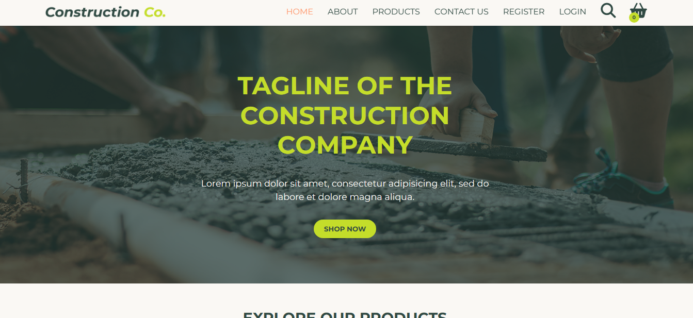

# E-COMMERCE WEBSITE FOR A CONSTRUCTION STORE

This is a collaborative project developed for our internship. The Construction Store Web Application provides a convenient platform for customers to order construction materials online. With this application, customers can browse through a wide range of construction products, add them to their cart, and place orders for delivery.

### Screenshots of the project

